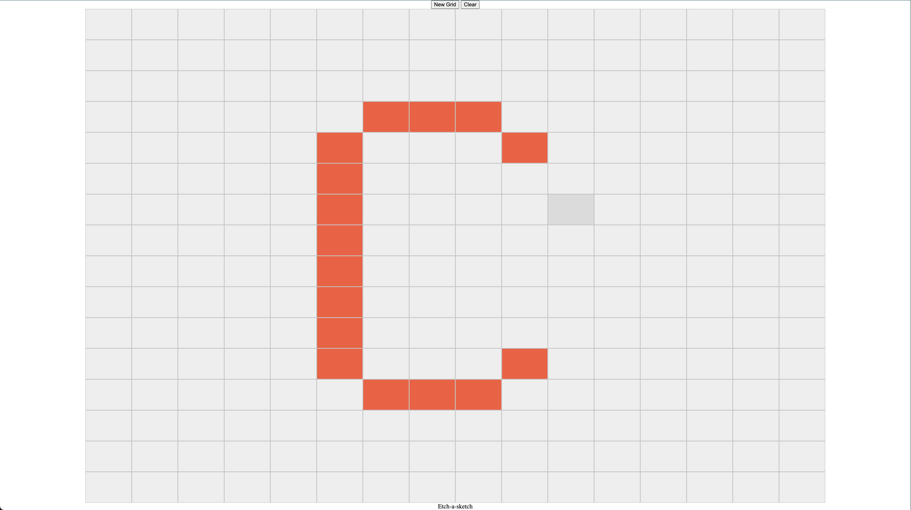

# Etch-a-Sketch

Etch-a-Sketch è una web app che riproduce il celebre gioco di disegno digitale. Muovi il mouse sulla griglia per "disegnare" colorando le celle!

## Funzionalità

- Griglia interattiva e responsive
- Celle che cambiano colore al passaggio o al click
- Pulsanti per resettare la griglia o modificarne la dimensione
- Design moderno, accessibile e ad alto contrasto
- Supporto per tastiera e focus visibile

## Come iniziare

1. Clona questo repository o scarica i file.
2. Apri `index.html` con un browser moderno.
3. Inizia a disegnare passando il mouse sulle celle.
4. Usa i pulsanti per resettare o cambiare la griglia.

## Struttura del progetto

- `index.html` — Pagina principale
- `styles.css` — Stili CSS accessibili e moderni
- `script.js` — Logica JavaScript della griglia

## Screenshot

 <!-- Inserisci uno screenshot se disponibile -->

## Licenza

Questo progetto è open source e libero per uso personale o didattico.

---

Realizzato da catellic. Readme generato da Copilot.
